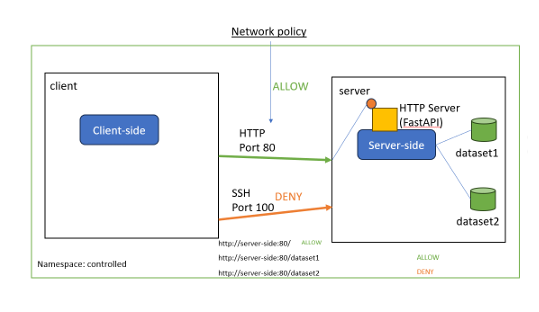
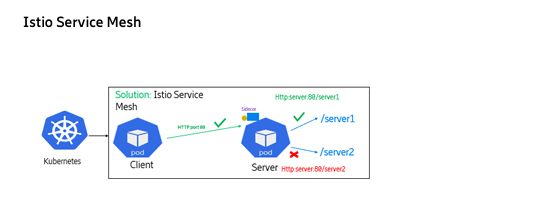

# Advanced API Access Control in Cloud-Native Environments

Internship project (March – September 2024) on securing APIs in two kinds of cloud-native environments:

- **Controlled environment:** you own the whole cluster, so security is enforced by the platform (Kubernetes NetworkPolicy + Istio service mesh).
- **Uncontrolled / shared environment:** you don't control the infrastructure, so security is enforced by the application using OAuth 2.0 with **Keycloak**.

The project compares both approaches and optimizes the Keycloak authorization flow to reduce latency.

---

## Project structure

```
api-access-control/
├── controlled/
│   ├── app/
│   │   ├── main.py              # FastAPI server: /, /dataset1, /dataset2
│   │   ├── Dockerfile
│   │   └── requirements.txt
│   ├── yaml/
│   │   ├── 01-namespace.yaml
│   │   ├── 02-service-accounts.yaml
│   │   ├── 03-deployments.yaml
│   │   ├── 04-services.yaml
│   │   ├── 05-network-policy.yaml
│   │   └── 06-istio-authorization.yaml
│   └── test-commands.sh
└── uncontrolled/
    ├── authentication.py
    ├── authorization.py
    ├── authorization_optimized.py
    ├── config.py
    ├── .env.example
    ├── requirements.txt
    └── yaml/keycloak.yaml
```

---

## 1. Controlled environment (`controlled/`)

| File | Purpose |
|---|---|
| `app/main.py` | The server app with `/`, `/dataset1` and `/dataset2`. It has no security code, because Kubernetes and Istio block requests before they reach the app. |



| `yaml/` | Namespace, service accounts, deployments, service, NetworkPolicy (only HTTP port 80 allowed) and Istio AuthorizationPolicies. |
| `test-commands.sh` | Checks that `/` and `/dataset1` return **200** and `/dataset2` returns **403**. |

### Run

```bash
docker build -t server-side:1.0 controlled/app
kubectl apply -f controlled/yaml/
sh controlled/test-commands.sh
```

---

## 2. Uncontrolled environment (`uncontrolled/`)

**Tokens:** the **access token** proves *who* the client is (authentication), and the **RPT** (Requesting Party Token) says *what* the client is allowed to access (authorization).

| File | Purpose |
|---|---|
| `authentication.py` | The client sends its ID and secret, gets an access token, and the token is checked with Keycloak's public key. |
| `authorization.py` | Default flow. On every request it gets a token, downloads the public key, gets an RPT and asks Keycloak to check it (introspection). |
| `authorization_optimized.py` | Optimized flow (see below). |

### Optimizations in `authorization_optimized.py`

1. The public key is downloaded once and kept (it refreshes if Keycloak changes its key).
2. The RPT is checked locally with that key, so the extra introspection call to Keycloak is gone.
3. The access token and RPT are reused until just before they expire.
4. One connection to Keycloak is reused instead of opening a new one each time.
5. If many requests arrive at once, only one of them asks Keycloak for a new token.

In testing, the first request called Keycloak 3 times and the second request made no Keycloak calls at all.

### Run

```bash
cd uncontrolled
pip install -r requirements.txt
cp .env.example .env        # add your Keycloak client secret
uvicorn authentication:app --port 8000
# or: uvicorn authorization:app --port 8000
# or: uvicorn authorization_optimized:app --port 8000
curl http://localhost:8000/read
```

---

## 3. Results

| Flow | Time | Exchanges |
|---|---|---|
| Baseline (no security) | 13.41 ms | 2 |
| Default authorization | 133.75 ms | 12 |
| Optimized authorization | 61.36 ms | 6 |

- **Time saved:** 133.75 − 61.36 = **72.39 ms**
- **Time reduction:** (72.39 ÷ 133.75) × 100 = **54.15%**
- **Exchanges saved:** 12 − 6 = **6**
- **Exchange reduction:** (6 ÷ 12) × 100 = **50%**
- **Security overhead** (time added on top of the baseline):
  - Default: 133.75 − 13.41 = 120.34 ms
  - Optimized: 61.36 − 13.41 = 47.95 ms
  - Reduction: (72.39 ÷ 120.34) × 100 = **60.2%**

---

## 4. What I discovered

### Advantages
1. Response time drops by 54% (133.75 ms to 61.36 ms), and Keycloak exchanges fall by half (12 to 6), because the public key and tokens are reused.
2. Tokens are still checked locally for signature, expiry and permissions, so security stays strong while load on Keycloak goes down.

### Disadvantages
1. Without introspection, a revoked token or removed permission is still accepted until the token expires.
2. The cached tokens and public key can become outdated, so tokens must be kept short-lived to limit this risk.

---
## 5. Solution: short-lived RPT + JavaScript policy (Keycloak authorization)
During the authorization step, I tested a JavaScript policy in Keycloak for dynamic access control. The policy asks an external score service for a score: if the score is 0.8 or higher, Keycloak grants the permission and issues the RPT; otherwise access is denied (403). If the score service fails, the score defaults to 0, so access is denied by default.

Combined with a short RPT lifetime (for example 1–5 minutes), this reduces both disadvantages: each time the RPT is renewed, Keycloak evaluates the policy again with the current score. A client whose access is removed or whose score drops is refused at the next renewal, so an outdated token can only be used for a few minutes.


## Tech stack

Kubernetes · Istio · Keycloak (OAuth 2.0, UMA / RPT) · FastAPI · Python · Docker
